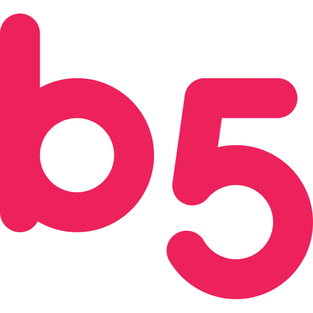
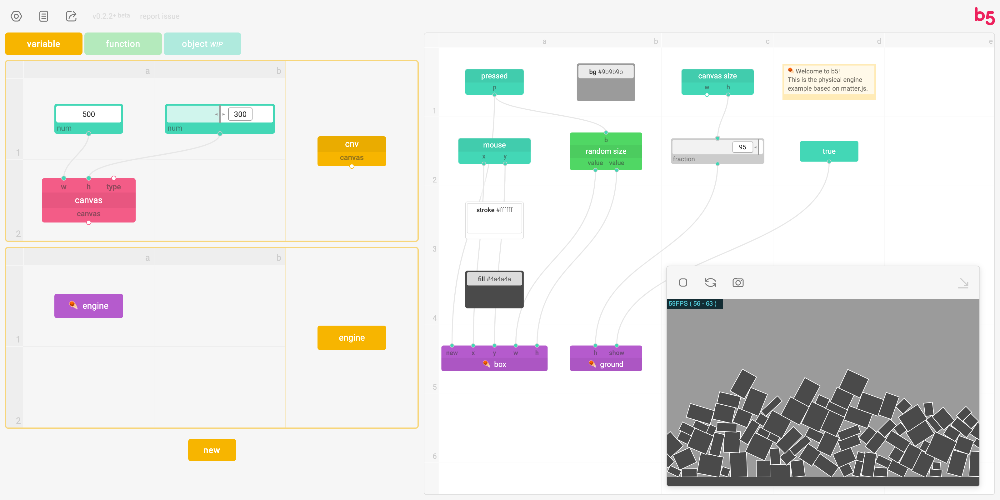
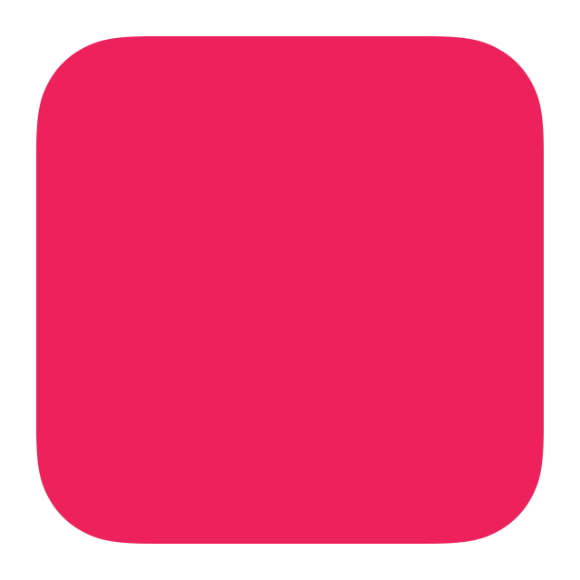
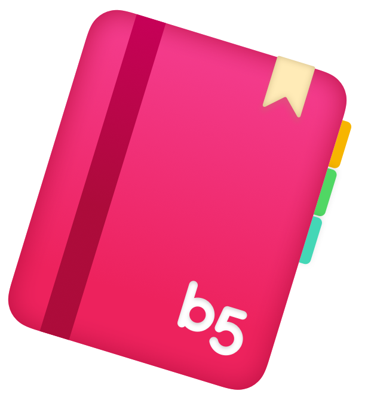
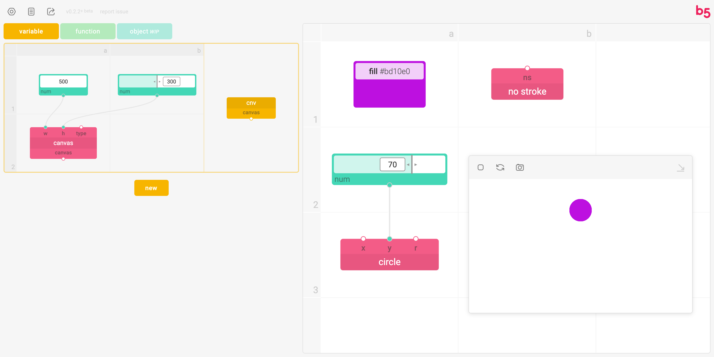
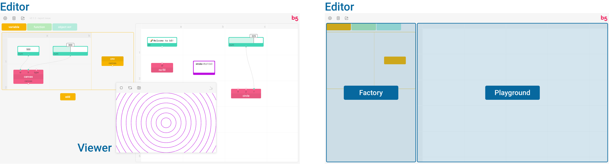
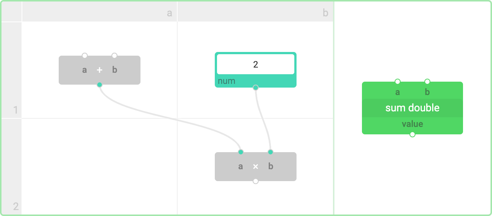
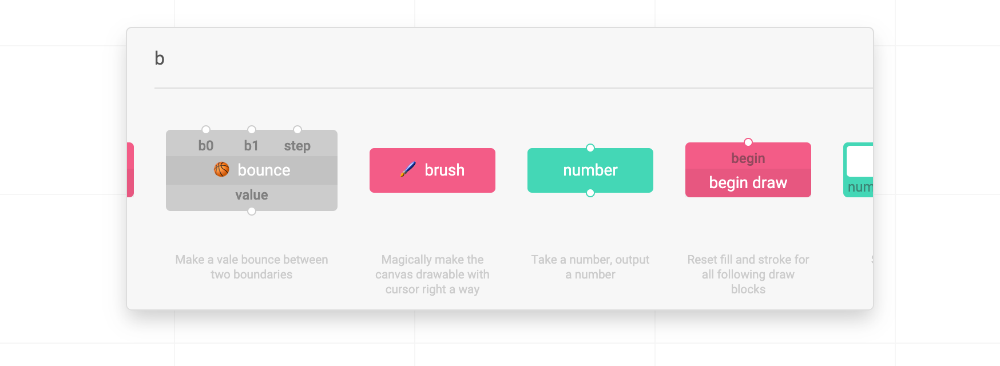
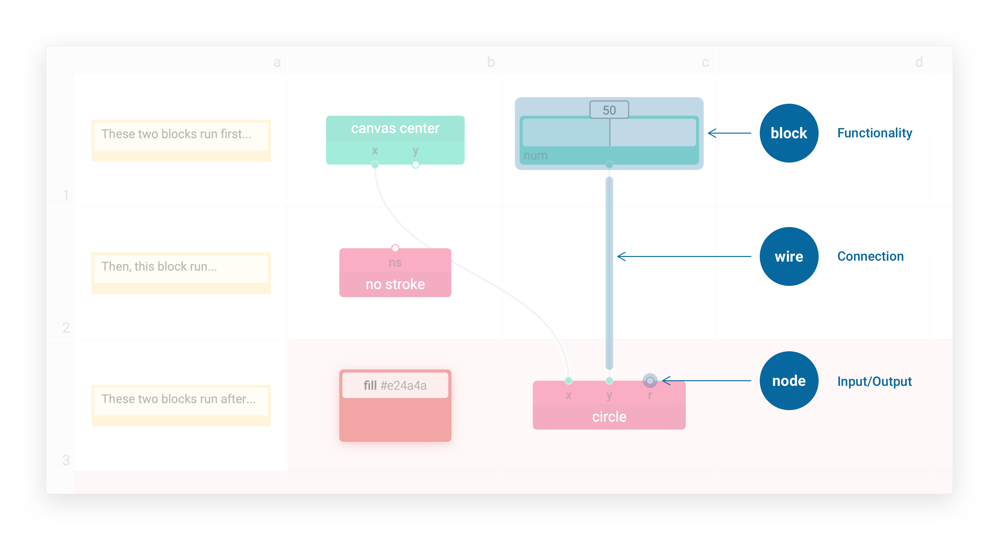
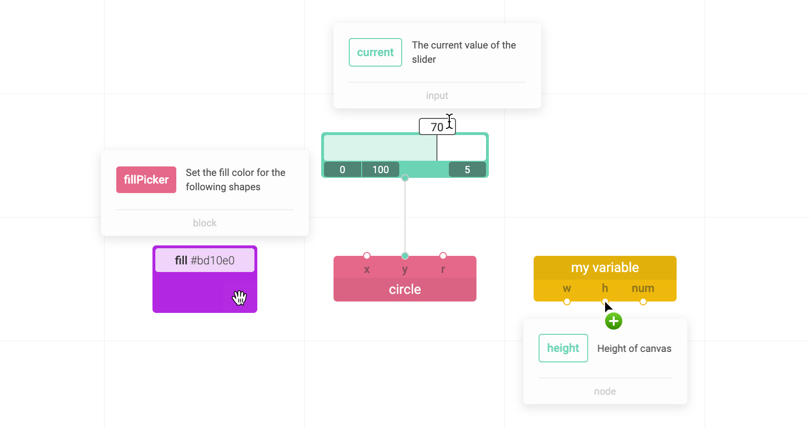

# 

[**Go to b5 Editor**](https://b5editor.app) | [**Project Documentation**](https://blog.jpl.design/posts/capstone/b5/) | [**Video Exposé**](https://vimeo.com/peiling/b5)



**b5 is for graphics, fast prototyping, and fun. Using blocks and wires, non-programmers can quickly build and share\* creative coding projects with the online editor featuring live coding and embedded documentation. Inspired by [p5.js](https://p5js.org/), b5 is multilingual\* and beginner-friendly.**

The interface is created to make coding easier, friendlier, more graphical, and instantly responsive to help beginners, artists, and visual learners quickly get hands on creative programming.

Using the metaphor of building blocks, flow chart, (and electrician diagram,) this new interface features not _lines of code_ but _blocks, nodes, and wires_ for you to draw on and interact with your canvas on the fly. Without restarting the sketch, you can see real-time changes of the canvas reflecting your code.

The project is still actively under development and you can visit the latest build at <a href="https://b5editor.app" rel="noopener noreferrer" target="_blank"> https://b5editor.app</a>.

_\* work-in-progress_

---

<br />
<p align="center">
  
</p>
<br />

## Quick Facts

1. **Sequence matters**<br />Unlike most node-based visual programming languages, e.g., [Grasshopper](https://www.rhino3d.com/6/new/grasshopper/) and [Max](https://cycling74.com/products/max), b5 has a grid system and does care about where you put each block. Regardless of how you connect them, b5 always executes blocks **from left to right, and line by line from top to bottom** - just like coding with text.
2. **60 FPS**<br />The main code canvas in the Playground section runs 60 times per second by default - just like `draw` function in p5.js.
3. **Save and continue**<br />Currently, after each session, you can save (`⌘/ctrl` + `s`) your progress as a JSON file. When you return, you can drag it into the editor to load and continue.
4. **Render with b5.js**<br />The blocks are rendered by a submodule called [b5.js](https://github.com/peilingjiang/b5.js). In the future, this library will be able to run solely and execute your b5 JSON files in other websites.

## Interface





### Editor

The programming environment where you can "code" on the fly, consists of two parts: **Factory** and **Playground**.

- **Playground**: Like **draw** function in p5.js, the main code canvas here runs from top to bottom for 60 times per second by default.
- **Factory**: Instead of only using predefined blocks, you can design and construct your own customized blocks here, including variables, functions, and objects here. The customized blocks will be rendered side-by-side with the code canvas and can be used as other blocks in Playground. To add them in Playground, additional to using block search, you can also directly drag the preview block from Factory into the main code canvas in Playground.
  <p align="center">
    
  </p>

  <br />
  Like **setup** function in p5.js, the definitions in this section will run for only once before Playground starts running. Rendered variable blocks don't take any inputs and have static outputs. Any change made to this section will re-initiate the running sketch.<br />

  <br />
  Like defining a function in text-based programming languages. The definitions will not be executed until you put the block into the Playground code canvas.<br />

  <br />
  _Work-in-progress_.

- **Block Search**: To add new blocks, you can use block search - **double click** at any empty block room in the code canvas that you want to add a block to, and search for name, type, or description of that block.

  

### Viewer

The live preview of your sketch, where you can pause/start, refresh, or capture the canvas. You can also minimize the viewer to the corner.

### Navigation

- **Left click (and hold)** to select/drag blocks, select/add wires, etc. Double click at code canvas to open block search.
- **Click and hold** at empty block rooms to navigate around the code canvas.
- **Scroll** to zoom in/out the code canvas. Hold the `shift` or `command/ctrl` key to scroll horizontally or vertically.

## Syntax

The code is based on blocks, nodes, and wires, representing functionality, input/output, and connection respectively.



Data flow from top (outputs) to bottom (inputs) via wires between blocks. One output can feed data to different inputs, while one input can only have one data source.

### Effect Block

Thanks to the sequential-sensitive design, **effect blocks** are introduced. The the red `fill` block above, effect blocks affect other blocks by their contextual relationships, e.g., the following blocks, or others in the same line, instead of wire connections. Like `fill()`, `stroke()`, and `scale()` function in p5.js that sets fill, stroke color, and scale factor for the following shapes.

When an effect block is selected, the background grid cells will also change color to reflect its effective range, unlike when working with text-based languages, the underlying status of the drawing context always remains hidden to the users and needs to be inferred from the actual behavior of the program.

## Documentation

The interface has the whole documentation embedded for reference. Simply hover the cursor onto blocks, nodes, or input boxes to get the explanation.



## Examples

You can load ⭐ random example files with detailed comments from the _Files_ icon at the top left corner of the editor. You are also encouraged to share your projects to be added into the list!

## 🧑‍💻 Development

This is still an early stage work-in-progress project with tons of features undone and bugs to expect, and all kinds of contributions - suggestions, discussions, bug report and fix, new blocks and features, UI improvement... - are more than welcome! 💜

You can report the problems, or start a new discussion with the link (at top left corner) in editor, or [here](https://github.com/peilingjiang/b5/issues/new).

### Setup

To clone the project to local for development, please follow the steps below: (Remember to **clone the submodules** as b5.js is currently used as a submodule instead of of package for the script rendering!)

```
git clone --recurse-submodules https://github.com/peilingjiang/b5.git
cd b5
npm run setup
```

To start developing, please open **two** terminal windows both looking at the root of this project folder and run the following two commands in each of them:

```shell
npm run css # if you want to modify CSS
```

```shell
npm start
```

The first one helps listen to changes of CSS files and optimize them, and the second one starts the development React build that will listen to any changes you make to lively reflect them in your page. It should automatically open a page from your default browser, but you can always go to `localhost:3000` as it's running.

### Commit

You don't need to do anything before creating a pull request - the code will be formatted upon commit and the production build will be built in server before hosting.

### To-dos

#### b5 Core

- [ ] Cover most of original p5.js functionalities
  - [ ] Bring videos, images, sounds into the canvas
  - [ ] _log_ block that can log the input value inside the block instead of into console
- [ ] _b5Iterate_ object: to stream multiple data from one block to another with one wire
- [ ] Error system: reusable type checking function; blocks, nodes, and wires turn red and shout to you when unintended input received
- [ ] Output _shape_ objects for drawing blocks: for you to get center, points, etc.
- [ ] Create your own "object" - what, why, and how?
- [ ] Bring in more libraries, create for full work flow for current Posenet library
- [x] Use more efficient renderer, like native HTML canvas or q5.js

#### Interface

- [ ] Preferences
- [ ] Quick guide of basic uses
- [ ] Share the file, section blocks, etc.
- [ ] Create quick preview version of code canvas to embed into websites
- [ ] Multi-language support to make it language independent for programming
- [ ] Select multiple blocks and drag, delete, etc. the collection
- [ ] `⌘/ctrl` + `z`
- [ ] `⌘/ctrl` + `c` and `v`
- [ ] Open viewer in a separate tab
- [ ] Accessibility

### Status

[](https://travis-ci.com/peilingjiang/b5)
[](https://app.netlify.com/sites/b5/deploys)

## References and Notes

Please see [References](https://blog.jpl.design/posts/capstone/b5/#references) in the project documentation.
