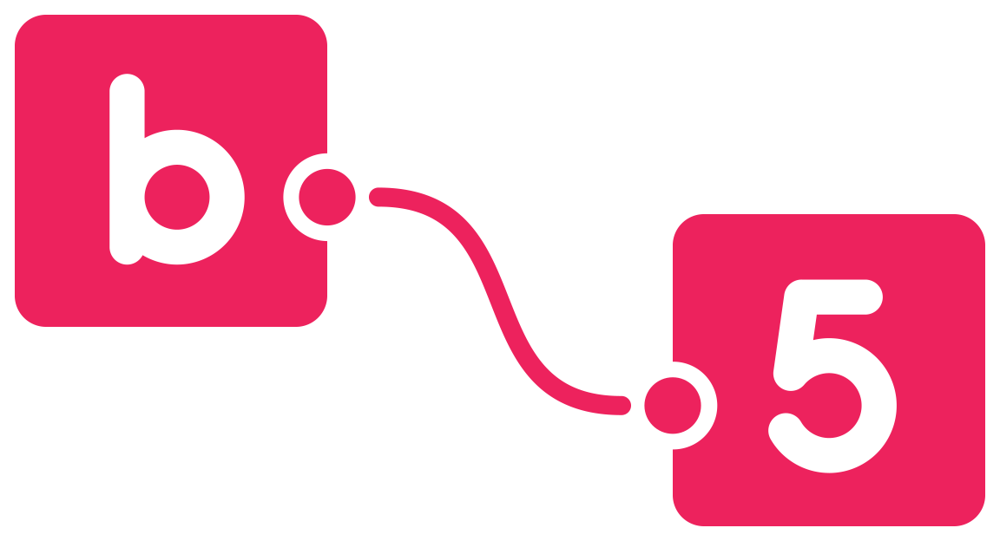
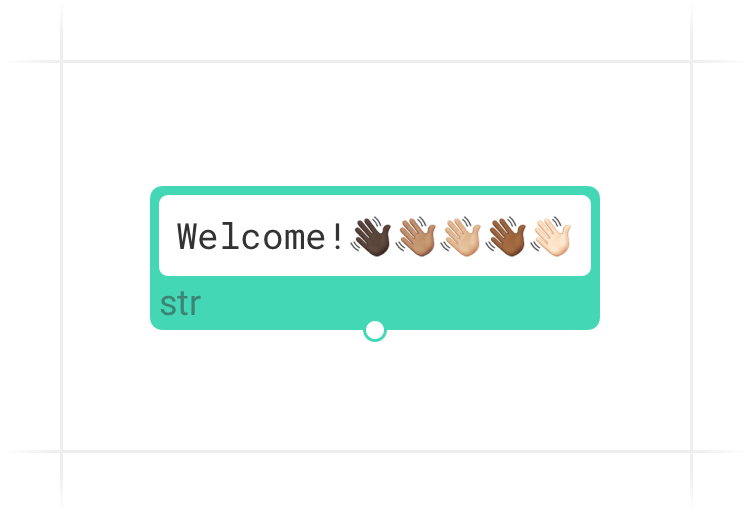
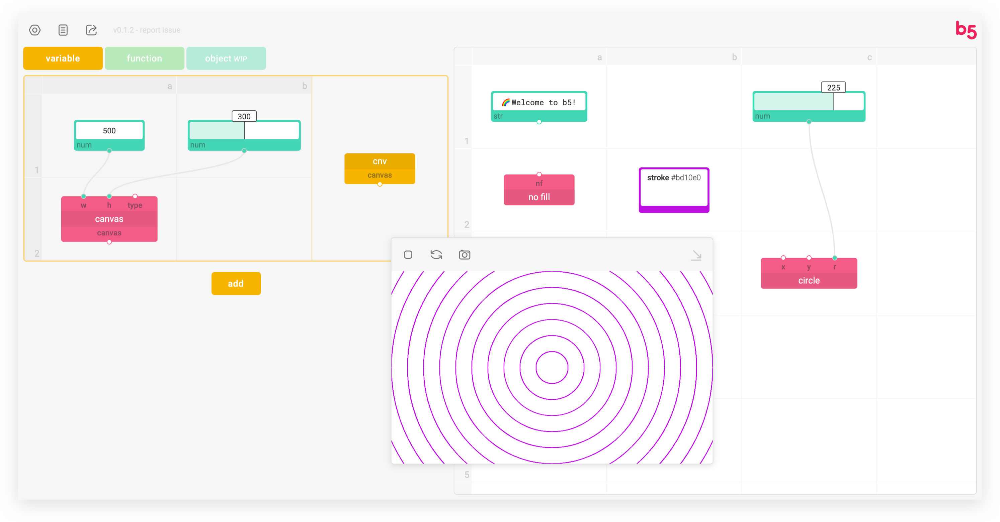
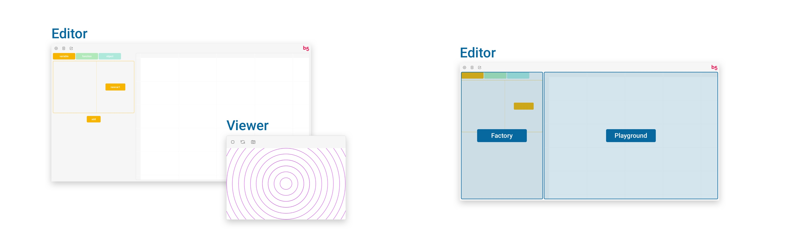

<p align="right">
  <a href="https://b5-editor.netlify.app" rel="noopener noreferrer" target="_blank">
    
  </a>
</p>

# b5

<br />
<p align="center">
    
</p>
<br />

[**Go to b5 Editor**](https://b5-editor.netlify.app)

b5 is a visual programming language for learning, prototyping, and fun. Based on [p5.js](https://p5js.org/), b5 shares many concepts while also optimizes for live programming, code visualization, embedded documentation, and more!

The interface is created to make coding easier and friendlier, more graphical, and instantly responsive, and help beginners, artists, and visual learners to quickly get hands on creative programming.

Using the metaphor of building blocks, flow chart, (and electrician diagram,) this new interface features not _lines of code_ but _blocks, nodes, and wires_ for you to draw on and interact with your canvas on the fly. Without restarting the sketch, you can see real-time changes of the canvas reflecting your code.

Currently, the project is still under development and you can visit the beta version here <a href="https://b5-editor.netlify.app" rel="noopener noreferrer" target="_blank"></a> (hosted on Netlify).

## 🌱 Get Started

<br />
<p align="center">
  
</p>
<br />

### Quick Facts

1. **Sequence matters**<br />Unlike most node-based visual programming languages, b5 does care about where you put each block. Regardless of how you connect them, b5 always executes blocks **from top to bottom, from left to right** - just like coding with text.
2. **60 FPS**<br />The Playground section runs 60 times per second by default.
3. **Save as JSON**<br />Currently, after each session, you can save (`⌘/ctrl` + `s`) your progress as a JSON file. When you return, you can drag it into the editor to load and continue.
4. **Render with b5.js**<br />The blocks are rendered by a submodule called [b5.js](https://github.com/peilingjiang/b5.js). In the future, this library will be able to run solely and render your b5 JSON files in other websites like p5.js.

### Interface

<p align="center">
  
</p>



#### Editor

The programming environment where you can "code" on the fly, consists of two parts: **Factory** and **Playground**:

- **Playground**: Just like p5's **draw** function, runs from top to bottom for 60 times per second by default.
- **Factory**: Instead of only using predefined blocks, you can design and construct your own variables, functions, or objects (not available yet) here.

  <br />
  Like p5's **setup** function, the definitions will run for only once before Playground starts running. Any change made to this section will re-initiate the running sketch.<br />

  <br />
  The definitions will not be executed until you put the block into the Playground code canvas.<br />

  <br />
  _Still work-in-progress_.<br />

  b5 will render a preview of your customized block for you on the right of each section, you may also rename it. To add the customized blocks into the Playground, you can directly drag the preview block from Factory to it, or you can add them as normal ones using block search.

  <p align="center">
    
  </p>
  <br />

- **Block Search**: To add new blocks, you can use search - double click at any empty block room that you want to add a block to, and search for name, type, or description of that block.

  <p align="center">
    
  </p>

#### Viewer

The live preview of your sketch, where you can Pause/Start, Refresh, or Capture your canvas. You can also minimize the viewer to the corner.

#### Navigation

**Left click (and hold)** to select/drag blocks, select/add wires, etc. Double click at code canvas to open block search.<br />
**Right click and hold** to navigate around the code canvas.<br />
**Scroll** to zoom in or out the code canvas. Hold the `shift` or `command/ctrl` key to scroll horizontally or vertically.

### Syntax

The code is based on blocks, nodes, and wires, representing functionality, input/output, and connection respectively.

<p align="center">
  
</p>

Data flow from top (outputs) to bottom (inputs) via wires between blocks. One output can feed data to different inputs, while one input can only have one data source.

#### Effect Block

In p5.js, we have some functions that can set the styles or matrix for the following geometries, like `fill()`, `stroke()`, or `scale()`. Here, b5 shares the same concept and when you click on the effect block, you'll also be able to see the affected range of it.

### Documentation

The interface has the whole documentation embedded for reference. Simply hover the cursor onto blocks, nodes, or input boxes to get the explanation.

<p align="center">
  
</p>

#### Examples

You can load ⭐ random example files with detailed comments from the _Files_ icon at the top left corner of editor. You are also encouraged to share your projects to be added into the list!

## 🧑‍💻 Development

This is still an early stage work-in-progress project with tons of features and bugs to expect, and all kinds of contributions - suggestions, discussions, bug report and fix, new blocks and features, UI improvement... - are more than welcome! 💜

You can report the problems, or start a new discussion with the link (at top left corner) in editor, or [here](https://github.com/peilingjiang/b5/issues/new).

### Setup

To clone the project to local for development, please follow the steps below: (Remember to **clone the submodules** as b5.js is currently used as a submodule instead of of package for the script rendering!)

```
git clone --recurse-submodules https://github.com/peilingjiang/b5.git
npm install
```

To start developing, please open **two** terminal windows both looking at the root of this project folder and run the following two commands in each of them:

```
npm run css
```

```
npm start
```

The first one helps listen to changes of CSS files and optimize them, and the second one starts the development React build that will listen to any changes you make to lively reflect them in your page. It should automatically open a page from your default browser, but you can always go to `localhost:3000` as it's running.

### Commit

You don't need to do anything before creating a pull request - the code will be formatted upon commit and the production build will be built in server before hosting.

### To-dos

#### b5 Core

- [ ] Cover most of original p5.js functionalities
  - [ ] Bring videos, images, sounds into the canvas
  - [ ] _log_ block that can log the input value inside the block instead of into console
- [ ] _b5Iterate_ object: to stream multiple data from one block to another with one wire
- [ ] Error system: reusable type checking function; blocks, nodes, and wires turn red and shout to you when unintended input received
- [ ] Output _shape_ objects for drawing blocks: for you to get center, points, etc.
- [ ] Create your own "object" - what, why, and how?
- [ ] Bring in more libraries, create for full work flow for current Posenet library
- [ ] Use more efficient render, like native HTML canvas or q5.js

#### Interface

- [ ] Preferences
- [ ] Quick guide of basic uses
- [ ] Share the file, section blocks, etc.
- [ ] Create quick preview version of code canvas to embed into websites
- [ ] Multi-language support to make it language independent for programming
- [ ] Select multiple blocks and drag, delete, etc. the collection
- [ ] `⌘/ctrl` + `z`
- [ ] `⌘/ctrl` + `c` and `v`
- [ ] Open viewer in a separate tab
- [ ] Accessibility

### Status

[](https://travis-ci.com/peilingjiang/b5)
[](https://deepscan.io/dashboard#view=project&tid=11376&pid=14279&bid=261607)
[](https://app.netlify.com/sites/b5-editor/deploys)

## References and Notes

1. [p5.js](https://github.com/processing/p5.js)
2. [Learnable Programming](http://worrydream.com/LearnableProgramming/) by Bret Victor
3. Awesome [visual programming languages](https://github.com/terkelg/awesome-creative-coding#visual-programming-languages) for creative coding
